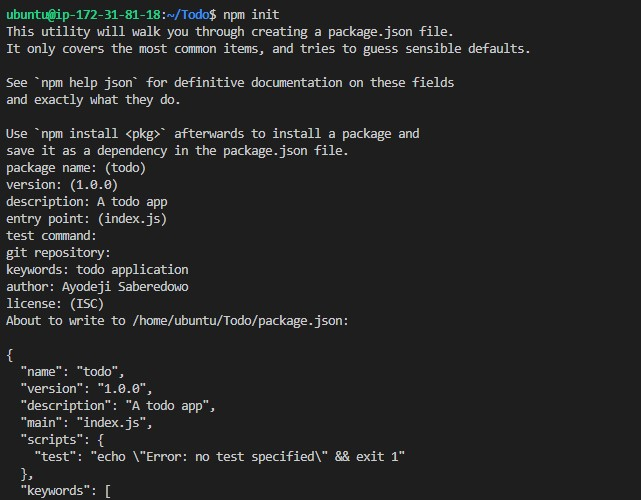

# PROJECT 3: MERN STACK IMPLEMENTATION
## Step 1 - Backend Configuration
### Update ubuntu
- `sudo apt update`
### Upgrade ubuntu
- `sudo apt upgrade`
### Get the location of Node.js software from Ubuntu repositories
- `curl -fsSL https://deb.nodesource.com/setup_18.x | sudo -E bash -`
### Install Node.js on the server
- `sudo apt-get install -y nodejs`
### Verify the version of node and npm installed
- `node -v`
- `npm -v `

## Application Code Setup
### Create new directory for the To-Do project
- `mkdir Todo`
- `cd Todo`
### initialise your project, so that a new file named package.json will be created.
- `npm init`

## Install ExpressJS
- `npm install express`

### create a file index.js
- `touch index.js`
### Run `ls` to confirm that your index.js file is successfully created
### Install the dotenv module
- `npm install dotenv`

### Open the index.js file
- `vim index.js`

### Use `:w` to save in vim and use `:qa` to exit vim

### start our server to see if it works 
- `node index.js`

### Checking from the web

### Create a folder "route" and cd in to it and create "api.js" file

### Install mongoose

### Create a new folder - models
- `mkdir models && cd models && touch todo.js`

## Create a MongoDB database and collection inside mLab
### Create a file in your Todo directory and name it .env.
- `touch .env`
- `vi .env`
### Add the connection string to access the database in it, just as below:
- `DB = 'mongodb+srv://<username>:<password>@<network-address>/<dbname>?retryWrites=true&w=majority'`

### Side Study

[Database Management Systems (DBMS) exist and what each type is more suitable for](https://www.alooma.com/blog/types-of-modern-databases)

[Datastream](https://cloud.google.com/datastream)

[Web Application Frameworks](https://en.wikipedia.org/wiki/Web_framework)
[Basic JavaScript syntax](https://www.w3schools.com/js/js_intro.asp)
[REST API Tutorial](https://restfulapi.net/)
[What is RESTful API?](https://aws.amazon.com/what-is/restful-api/)
[Basic Syntax and Properties of CSS](https://www.w3schools.com/css/css_intro.asp)

